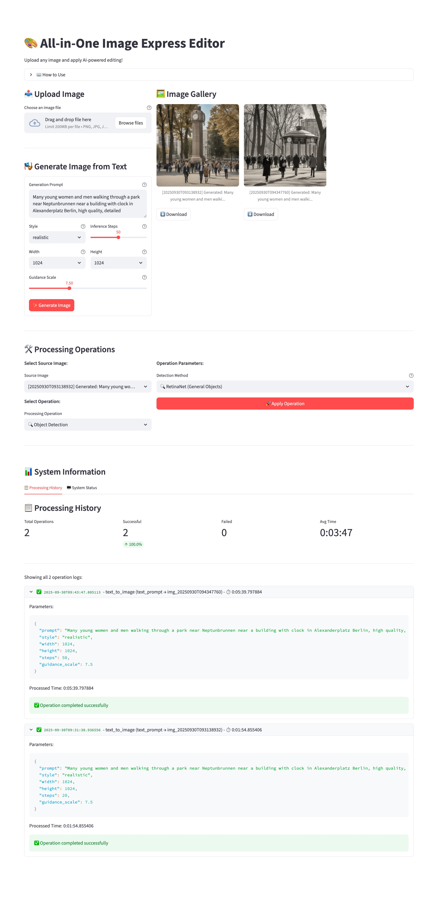
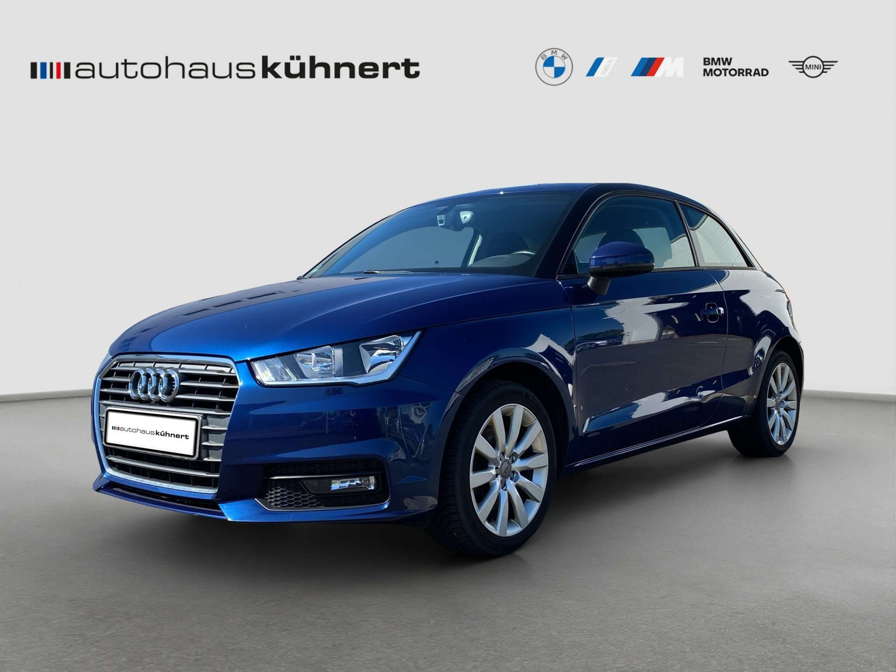
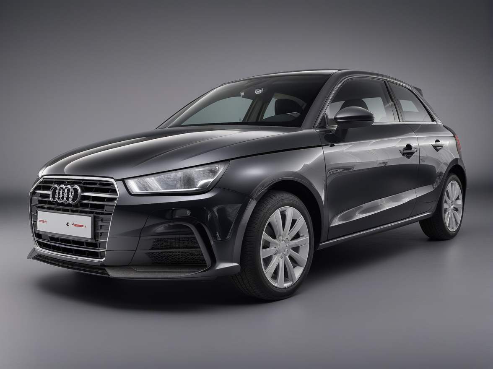
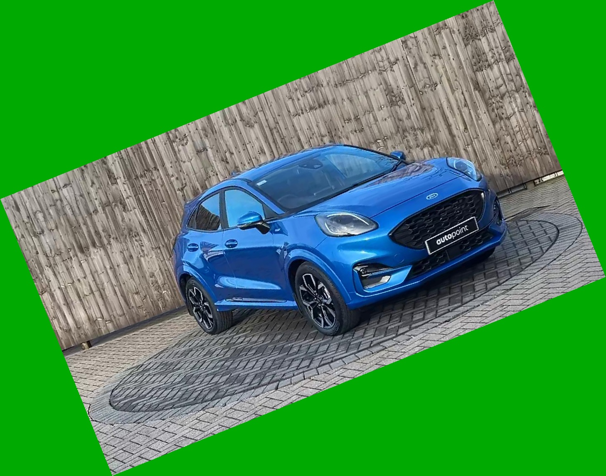
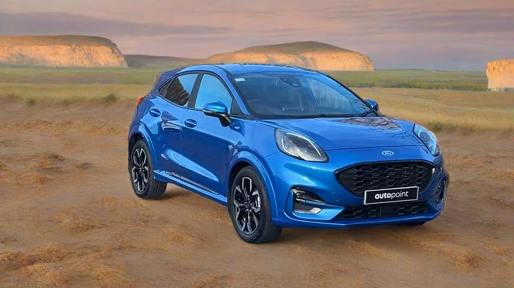
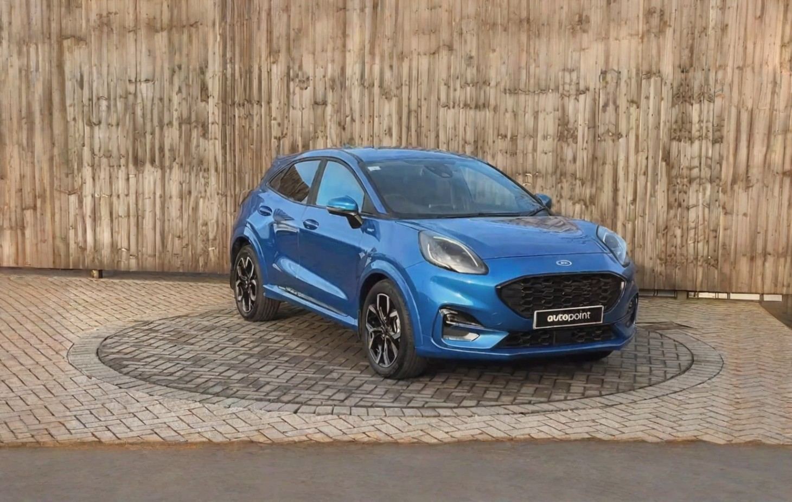
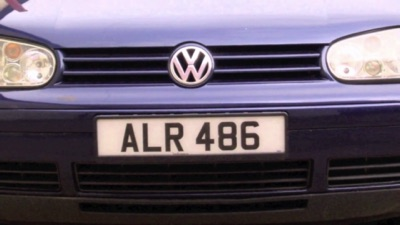
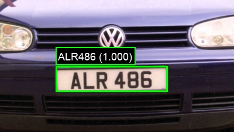
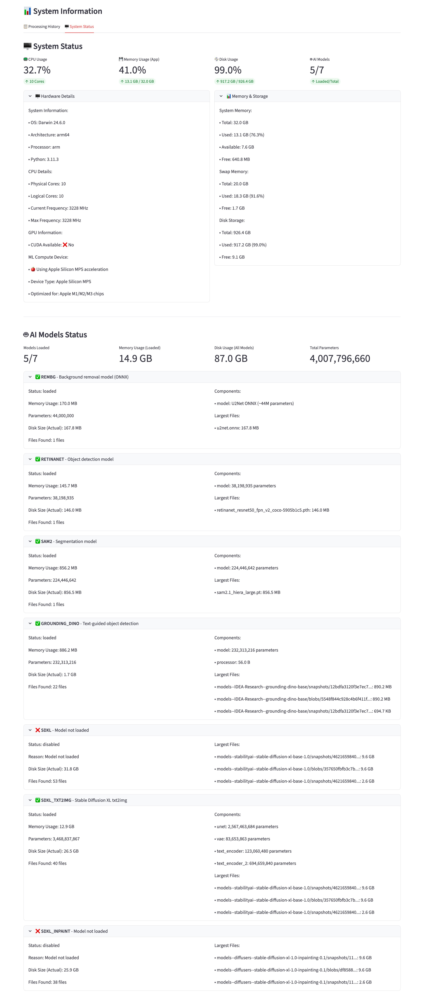

# Image Express Editor

**Status:**

  + OK

**DEMO:**

  + https://image-express-editor.streamlit.app

**Example Usage: Car Image Processing Workflow**

- Input Image →
- Car Detection (RetinaNet) →
- Segmentation (SAM2) →
- License Plate Detection/Removal (Grounding DINO + SAM2) →
- Edge Extraction (Canny) →
- AI Generation (SDXL + ControlNet) →
- Background Removal (rembg) →
- Shadow Effects →
- Final Polished Cutout

-----

## Screenshots

### Web app

<kbd></kbd>

### Example 1: Image-to-Image Generation

- Original pictures:
  <kbd></kbd>
  <kbd></kbd>

- Generated pictures based on edge map:
  <kbd></kbd>
  <kbd></kbd>
  <kbd></kbd>

### Example 2: Text-to-Image Generation

- Prompt: a young woman on beach, high quality, detailed
  <kbd></kbd>

- Prompt: a young woman walking on summer beach, high quality, detailed
  <kbd></kbd>

- Notes: It's OK for generating cartoon images, but not good enough for realistic ones. The quality can be improved with more inference steps or better model with huge dataset. Examples from Freepik:
  <kbd></kbd>
  <kbd></kbd>

### Example 3a: Object Detection & Blurring

Detect license plate and blur it

- Original picture:
  <kbd></kbd>

- Processed picture:
  <kbd></kbd>

### Example 3b: Object Detection & Background Removal ++

Detect object (car) and remove the background

- Original picture:
  <kbd></kbd>

- Background removal:
  <kbd></kbd>

- Smart shadow:
  <kbd></kbd>

### Example 3c: Image Rotation

Simply rotate the image

- Original picture:
  <kbd></kbd>

- Processed picture:
  <kbd></kbd>

### Example 3d: Image Color Update

Change the picture's brightness, contrast, saturation, sharpness

- Original picture:
  <kbd></kbd>

- Processed picture:
  <kbd></kbd>

### Example 4: Object Detection & Inpainting

Detect object and replace it with another object (car)

- Original picture:
  <kbd></kbd>

- Processed picture:
  <kbd></kbd>

### Example 5: Object Detection & Outpainting (precise mask)

Detect object (car) and paint the background

- Original picture:
  <kbd></kbd>

- Processed picture:
  <kbd></kbd>

### Example 6: Object Detection & Outpainting (extended canvas)

Expand the picture with generated pixels

- Original picture:
  <kbd></kbd>

- Processed picture:
  <kbd></kbd>

### Example 7: License Plate Detection & Recognization (OCR)

- Original picture:
  <kbd></kbd>

- Processed picture:
  <kbd></kbd>

-----

## Technology

### Software Engineering

- Python
- PyTorch
- OpenCV
- Streamlit

### AI Models

- RetinaNet ResNet50-FPN-V2: Object detection and bounding box extraction..
- SAM2 (Hiera-Large): Precise image segmentation for object masks.
- Grounding DINO Base: Text-prompted object detection (e.g. human, car, license plate).
- Stable Diffusion XL Base 1.0: AI image generation.
  - Euler Ancestral Discrete Scheduler: Sampling scheduler for diffusion process.
- ControlNet Canny SDXL 1.0: Edge-guided image generation control. Type: ControlNet model for SDXL.
- SDXL VAE FP16 Fix: Improved VAE for SDXL pipeline. Type: AutoencoderKL optimized for FP16.
- Stable Diffusion XL Inpainting: AI image inpainting.
- rembg (u2net): Background removal from images.
- EasyOCR: Detecting and extracting text from images.

-----

## How to run

### Setup environment

```sh
# ----- Prepare environment
# Check the Python version:
python --version
# Python 3.11.3

# Create local project env:
python -m venv venv
# Activate the local env:
source venv/bin/activate

# Install dependencies:
pip install --no-cache-dir -r requirements.txt
# pip install --no-cache-dir --trusted-host pypi.org --trusted-host files.pythonhosted.org -r requirements.txt
```

```log
Collecting git+https://github.com/facebookresearch/segment-anything-2 (from -r requirements.txt (line 6))
  Cloning https://github.com/facebookresearch/segment-anything-2 to /private/var/folders/lj/97917ghj2g97x64bq8_v76rh0000gq/T/pip-req-build-muo7qfh7
  Running command git clone --filter=blob:none --quiet https://github.com/facebookresearch/segment-anything-2 /private/var/folders/lj/97917ghj2g97x64bq8_v76rh0000gq/T/pip-req-build-muo7qfh7
  Resolved https://github.com/facebookresearch/segment-anything-2 to commit 2b90b9f5ceec907a1c18123530e92e794ad901a4
  Installing build dependencies ... done
  Getting requirements to build wheel ... done
  Preparing metadata (pyproject.toml) ... done
Collecting torch
  Downloading torch-2.8.0-cp311-none-macosx_11_0_arm64.whl (73.6 MB)
     ━━━━━━━━━━━━━━━━━━━━━━━━━━━━━━━━━━━━━━━━ 73.6/73.6 MB 6.5 MB/s eta 0:00:00
Collecting torchvision
  Downloading torchvision-0.23.0-cp311-cp311-macosx_11_0_arm64.whl (1.9 MB)
     ━━━━━━━━━━━━━━━━━━━━━━━━━━━━━━━━━━━━━━━━ 1.9/1.9 MB 6.6 MB/s eta 0:00:00
Collecting opencv-python
  Downloading opencv_python-4.12.0.88-cp37-abi3-macosx_13_0_arm64.whl (37.9 MB)
     ━━━━━━━━━━━━━━━━━━━━━━━━━━━━━━━━━━━━━━━━ 37.9/37.9 MB 5.6 MB/s eta 0:00:00
Collecting pillow
  Downloading pillow-11.3.0-cp311-cp311-macosx_11_0_arm64.whl (4.7 MB)
     ━━━━━━━━━━━━━━━━━━━━━━━━━━━━━━━━━━━━━━━━ 4.7/4.7 MB 6.7 MB/s eta 0:00:00
Collecting numpy<2
  Downloading numpy-1.26.4-cp311-cp311-macosx_11_0_arm64.whl (14.0 MB)
     ━━━━━━━━━━━━━━━━━━━━━━━━━━━━━━━━━━━━━━━━ 14.0/14.0 MB 6.0 MB/s eta 0:00:00
Collecting scipy
  Downloading scipy-1.16.2-cp311-cp311-macosx_14_0_arm64.whl (20.9 MB)
     ━━━━━━━━━━━━━━━━━━━━━━━━━━━━━━━━━━━━━━━━ 20.9/20.9 MB 6.8 MB/s eta 0:00:00
Collecting transformers==4.48.3
  Downloading transformers-4.48.3-py3-none-any.whl (9.7 MB)
     ━━━━━━━━━━━━━━━━━━━━━━━━━━━━━━━━━━━━━━━━ 9.7/9.7 MB 7.1 MB/s eta 0:00:00
Collecting diffusers
  Downloading diffusers-0.35.1-py3-none-any.whl (4.1 MB)
     ━━━━━━━━━━━━━━━━━━━━━━━━━━━━━━━━━━━━━━━━ 4.1/4.1 MB 4.5 MB/s eta 0:00:00
Collecting accelerate
  Downloading accelerate-1.10.1-py3-none-any.whl (374 kB)
     ━━━━━━━━━━━━━━━━━━━━━━━━━━━━━━━━━━━━━━━━ 374.9/374.9 kB 8.3 MB/s eta 0:00:00
Collecting safetensors
  Downloading safetensors-0.6.2-cp38-abi3-macosx_11_0_arm64.whl (432 kB)
     ━━━━━━━━━━━━━━━━━━━━━━━━━━━━━━━━━━━━━━━━ 432.2/432.2 kB 6.2 MB/s eta 0:00:00
Collecting rembg
  Downloading rembg-2.0.67-py3-none-any.whl (44 kB)
     ━━━━━━━━━━━━━━━━━━━━━━━━━━━━━━━━━━━━━━━━ 44.1/44.1 kB 29.1 MB/s eta 0:00:00
Collecting onnxruntime
  Downloading onnxruntime-1.23.0-cp311-cp311-macosx_13_0_arm64.whl (17.1 MB)
     ━━━━━━━━━━━━━━━━━━━━━━━━━━━━━━━━━━━━━━━━ 17.1/17.1 MB 6.2 MB/s eta 0:00:00
Collecting easyocr
  Downloading easyocr-1.7.2-py3-none-any.whl (2.9 MB)
     ━━━━━━━━━━━━━━━━━━━━━━━━━━━━━━━━━━━━━━━━ 2.9/2.9 MB 5.5 MB/s eta 0:00:00
Collecting pytesseract
  Downloading pytesseract-0.3.13-py3-none-any.whl (14 kB)
Collecting streamlit
  Downloading streamlit-1.50.0-py3-none-any.whl (10.1 MB)
     ━━━━━━━━━━━━━━━━━━━━━━━━━━━━━━━━━━━━━━━━ 10.1/10.1 MB 6.5 MB/s eta 0:00:00
Collecting requests
  Downloading requests-2.32.5-py3-none-any.whl (64 kB)
     ━━━━━━━━━━━━━━━━━━━━━━━━━━━━━━━━━━━━━━━━ 64.7/64.7 kB 22.0 MB/s eta 0:00:00
Collecting urllib3
  Downloading urllib3-2.5.0-py3-none-any.whl (129 kB)
     ━━━━━━━━━━━━━━━━━━━━━━━━━━━━━━━━━━━━━━━━ 129.8/129.8 kB 1.7 MB/s eta 0:00:00
Collecting filelock
  Downloading filelock-3.19.1-py3-none-any.whl (15 kB)
Collecting huggingface-hub<1.0,>=0.24.0
  Downloading huggingface_hub-0.35.3-py3-none-any.whl (564 kB)
     ━━━━━━━━━━━━━━━━━━━━━━━━━━━━━━━━━━━━━━━━ 564.3/564.3 kB 5.6 MB/s eta 0:00:00
Collecting packaging>=20.0
  Downloading packaging-25.0-py3-none-any.whl (66 kB)
     ━━━━━━━━━━━━━━━━━━━━━━━━━━━━━━━━━━━━━━━━ 66.5/66.5 kB 3.0 MB/s eta 0:00:00
Collecting pyyaml>=5.1
  Downloading pyyaml-6.0.3-cp311-cp311-macosx_11_0_arm64.whl (175 kB)
     ━━━━━━━━━━━━━━━━━━━━━━━━━━━━━━━━━━━━━━━━ 175.6/175.6 kB 7.6 MB/s eta 0:00:00
Collecting regex!=2019.12.17
  Downloading regex-2025.9.18-cp311-cp311-macosx_11_0_arm64.whl (286 kB)
     ━━━━━━━━━━━━━━━━━━━━━━━━━━━━━━━━━━━━━━━━ 286.6/286.6 kB 6.5 MB/s eta 0:00:00
Collecting tokenizers<0.22,>=0.21
  Downloading tokenizers-0.21.4-cp39-abi3-macosx_11_0_arm64.whl (2.7 MB)
     ━━━━━━━━━━━━━━━━━━━━━━━━━━━━━━━━━━━━━━━━ 2.7/2.7 MB 6.8 MB/s eta 0:00:00
Collecting tqdm>=4.27
  Downloading tqdm-4.67.1-py3-none-any.whl (78 kB)
     ━━━━━━━━━━━━━━━━━━━━━━━━━━━━━━━━━━━━━━━━ 78.5/78.5 kB 7.3 MB/s eta 0:00:00
Collecting typing-extensions>=4.10.0
  Downloading typing_extensions-4.15.0-py3-none-any.whl (44 kB)
     ━━━━━━━━━━━━━━━━━━━━━━━━━━━━━━━━━━━━━━━━ 44.6/44.6 kB 9.4 MB/s eta 0:00:00
Collecting sympy>=1.13.3
  Downloading sympy-1.14.0-py3-none-any.whl (6.3 MB)
     ━━━━━━━━━━━━━━━━━━━━━━━━━━━━━━━━━━━━━━━━ 6.3/6.3 MB 6.5 MB/s eta 0:00:00
Collecting networkx
  Downloading networkx-3.5-py3-none-any.whl (2.0 MB)
     ━━━━━━━━━━━━━━━━━━━━━━━━━━━━━━━━━━━━━━━━ 2.0/2.0 MB 5.8 MB/s eta 0:00:00
Collecting jinja2
  Downloading jinja2-3.1.6-py3-none-any.whl (134 kB)
     ━━━━━━━━━━━━━━━━━━━━━━━━━━━━━━━━━━━━━━━━ 134.9/134.9 kB 9.8 MB/s eta 0:00:00
Collecting fsspec
  Downloading fsspec-2025.9.0-py3-none-any.whl (199 kB)
     ━━━━━━━━━━━━━━━━━━━━━━━━━━━━━━━━━━━━━━━━ 199.3/199.3 kB 6.6 MB/s eta 0:00:00
Collecting hydra-core>=1.3.2
  Downloading hydra_core-1.3.2-py3-none-any.whl (154 kB)
     ━━━━━━━━━━━━━━━━━━━━━━━━━━━━━━━━━━━━━━━━ 154.5/154.5 kB 6.9 MB/s eta 0:00:00
Collecting iopath>=0.1.10
  Downloading iopath-0.1.10.tar.gz (42 kB)
     ━━━━━━━━━━━━━━━━━━━━━━━━━━━━━━━━━━━━━━━━ 42.2/42.2 kB 34.5 MB/s eta 0:00:00
  Preparing metadata (setup.py) ... done
Collecting opencv-python
  Downloading opencv_python-4.11.0.86-cp37-abi3-macosx_13_0_arm64.whl (37.3 MB)
     ━━━━━━━━━━━━━━━━━━━━━━━━━━━━━━━━━━━━━━━━ 37.3/37.3 MB 5.9 MB/s eta 0:00:00
Collecting importlib_metadata
  Downloading importlib_metadata-8.7.0-py3-none-any.whl (27 kB)
Collecting psutil
  Downloading psutil-7.1.0-cp36-abi3-macosx_11_0_arm64.whl (246 kB)
     ━━━━━━━━━━━━━━━━━━━━━━━━━━━━━━━━━━━━━━━━ 246.7/246.7 kB 11.7 MB/s eta 0:00:00
Collecting jsonschema
  Downloading jsonschema-4.25.1-py3-none-any.whl (90 kB)
     ━━━━━━━━━━━━━━━━━━━━━━━━━━━━━━━━━━━━━━━━ 90.0/90.0 kB 7.5 MB/s eta 0:00:00
Collecting opencv-python-headless
  Downloading opencv_python_headless-4.12.0.88-cp37-abi3-macosx_13_0_arm64.whl (37.9 MB)
     ━━━━━━━━━━━━━━━━━━━━━━━━━━━━━━━━━━━━━━━━ 37.9/37.9 MB 6.6 MB/s eta 0:00:00
Collecting pooch
  Downloading pooch-1.8.2-py3-none-any.whl (64 kB)
     ━━━━━━━━━━━━━━━━━━━━━━━━━━━━━━━━━━━━━━━━ 64.6/64.6 kB 21.6 MB/s eta 0:00:00
Collecting pymatting
  Downloading pymatting-1.1.14-py3-none-any.whl (54 kB)
     ━━━━━━━━━━━━━━━━━━━━━━━━━━━━━━━━━━━━━━━━ 54.7/54.7 kB 85.6 MB/s eta 0:00:00
Collecting scikit-image
  Downloading scikit_image-0.25.2-cp311-cp311-macosx_12_0_arm64.whl (13.2 MB)
     ━━━━━━━━━━━━━━━━━━━━━━━━━━━━━━━━━━━━━━━━ 13.2/13.2 MB 6.5 MB/s eta 0:00:00
Collecting coloredlogs
  Downloading coloredlogs-15.0.1-py2.py3-none-any.whl (46 kB)
     ━━━━━━━━━━━━━━━━━━━━━━━━━━━━━━━━━━━━━━━━ 46.0/46.0 kB 224.8 MB/s eta 0:00:00
Collecting flatbuffers
  Downloading flatbuffers-25.9.23-py2.py3-none-any.whl (30 kB)
Collecting protobuf
  Downloading protobuf-6.32.1-cp39-abi3-macosx_10_9_universal2.whl (426 kB)
     ━━━━━━━━━━━━━━━━━━━━━━━━━━━━━━━━━━━━━━━━ 426.5/426.5 kB 6.6 MB/s eta 0:00:00
Collecting python-bidi
  Downloading python_bidi-0.6.6-cp311-cp311-macosx_11_0_arm64.whl (264 kB)
     ━━━━━━━━━━━━━━━━━━━━━━━━━━━━━━━━━━━━━━━━ 264.0/264.0 kB 7.0 MB/s eta 0:00:00
Collecting Shapely
  Downloading shapely-2.1.2-cp311-cp311-macosx_11_0_arm64.whl (1.6 MB)
     ━━━━━━━━━━━━━━━━━━━━━━━━━━━━━━━━━━━━━━━━ 1.6/1.6 MB 7.2 MB/s eta 0:00:00
Collecting pyclipper
  Downloading pyclipper-1.3.0.post6-cp311-cp311-macosx_10_9_universal2.whl (270 kB)
     ━━━━━━━━━━━━━━━━━━━━━━━━━━━━━━━━━━━━━━━━ 270.9/270.9 kB 9.5 MB/s eta 0:00:00
Collecting ninja
  Downloading ninja-1.13.0-py3-none-macosx_10_9_universal2.whl (310 kB)
     ━━━━━━━━━━━━━━━━━━━━━━━━━━━━━━━━━━━━━━━━ 310.1/310.1 kB 7.7 MB/s eta 0:00:00
Collecting altair!=5.4.0,!=5.4.1,<6,>=4.0
  Downloading altair-5.5.0-py3-none-any.whl (731 kB)
     ━━━━━━━━━━━━━━━━━━━━━━━━━━━━━━━━━━━━━━━━ 731.2/731.2 kB 7.3 MB/s eta 0:00:00
Collecting blinker<2,>=1.5.0
  Downloading blinker-1.9.0-py3-none-any.whl (8.5 kB)
Collecting cachetools<7,>=4.0
  Downloading cachetools-6.2.0-py3-none-any.whl (11 kB)
Collecting click<9,>=7.0
  Downloading click-8.3.0-py3-none-any.whl (107 kB)
     ━━━━━━━━━━━━━━━━━━━━━━━━━━━━━━━━━━━━━━━━ 107.3/107.3 kB 6.0 MB/s eta 0:00:00
Collecting pandas<3,>=1.4.0
  Downloading pandas-2.3.3-cp311-cp311-macosx_11_0_arm64.whl (10.8 MB)
     ━━━━━━━━━━━━━━━━━━━━━━━━━━━━━━━━━━━━━━━━ 10.8/10.8 MB 6.5 MB/s eta 0:00:00
Collecting pyarrow>=7.0
  Downloading pyarrow-21.0.0-cp311-cp311-macosx_12_0_arm64.whl (31.2 MB)
     ━━━━━━━━━━━━━━━━━━━━━━━━━━━━━━━━━━━━━━━━ 31.2/31.2 MB 5.9 MB/s eta 0:00:00
Collecting tenacity<10,>=8.1.0
  Downloading tenacity-9.1.2-py3-none-any.whl (28 kB)
Collecting toml<2,>=0.10.1
  Downloading toml-0.10.2-py2.py3-none-any.whl (16 kB)
Collecting gitpython!=3.1.19,<4,>=3.0.7
  Downloading gitpython-3.1.45-py3-none-any.whl (208 kB)
     ━━━━━━━━━━━━━━━━━━━━━━━━━━━━━━━━━━━━━━━━ 208.2/208.2 kB 7.6 MB/s eta 0:00:00
Collecting pydeck<1,>=0.8.0b4
  Downloading pydeck-0.9.1-py2.py3-none-any.whl (6.9 MB)
     ━━━━━━━━━━━━━━━━━━━━━━━━━━━━━━━━━━━━━━━━ 6.9/6.9 MB 6.0 MB/s eta 0:00:00
Collecting tornado!=6.5.0,<7,>=6.0.3
  Downloading tornado-6.5.2-cp39-abi3-macosx_10_9_universal2.whl (442 kB)
     ━━━━━━━━━━━━━━━━━━━━━━━━━━━━━━━━━━━━━━━━ 442.6/442.6 kB 8.0 MB/s eta 0:00:00
Collecting charset_normalizer<4,>=2
  Downloading charset_normalizer-3.4.3-cp311-cp311-macosx_10_9_universal2.whl (204 kB)
     ━━━━━━━━━━━━━━━━━━━━━━━━━━━━━━━━━━━━━━━━ 204.5/204.5 kB 6.9 MB/s eta 0:00:00
Collecting idna<4,>=2.5
  Downloading idna-3.10-py3-none-any.whl (70 kB)
     ━━━━━━━━━━━━━━━━━━━━━━━━━━━━━━━━━━━━━━━━ 70.4/70.4 kB 5.7 MB/s eta 0:00:00
Collecting certifi>=2017.4.17
  Downloading certifi-2025.8.3-py3-none-any.whl (161 kB)
     ━━━━━━━━━━━━━━━━━━━━━━━━━━━━━━━━━━━━━━━━ 161.2/161.2 kB 8.3 MB/s eta 0:00:00
Collecting narwhals>=1.14.2
  Downloading narwhals-2.6.0-py3-none-any.whl (408 kB)
     ━━━━━━━━━━━━━━━━━━━━━━━━━━━━━━━━━━━━━━━━ 408.4/408.4 kB 8.4 MB/s eta 0:00:00
Collecting gitdb<5,>=4.0.1
  Downloading gitdb-4.0.12-py3-none-any.whl (62 kB)
     ━━━━━━━━━━━━━━━━━━━━━━━━━━━━━━━━━━━━━━━━ 62.8/62.8 kB 47.7 MB/s eta 0:00:00
Collecting hf-xet<2.0.0,>=1.1.3
  Downloading hf_xet-1.1.10-cp37-abi3-macosx_11_0_arm64.whl (2.6 MB)
     ━━━━━━━━━━━━━━━━━━━━━━━━━━━━━━━━━━━━━━━━ 2.6/2.6 MB 5.9 MB/s eta 0:00:00
Collecting omegaconf<2.4,>=2.2
  Downloading omegaconf-2.3.0-py3-none-any.whl (79 kB)
     ━━━━━━━━━━━━━━━━━━━━━━━━━━━━━━━━━━━━━━━━ 79.5/79.5 kB 8.2 MB/s eta 0:00:00
Collecting antlr4-python3-runtime==4.9.*
  Downloading antlr4-python3-runtime-4.9.3.tar.gz (117 kB)
     ━━━━━━━━━━━━━━━━━━━━━━━━━━━━━━━━━━━━━━━━ 117.0/117.0 kB 16.2 MB/s eta 0:00:00
  Preparing metadata (setup.py) ... done
Collecting portalocker
  Downloading portalocker-3.2.0-py3-none-any.whl (22 kB)
Collecting attrs>=22.2.0
  Downloading attrs-25.3.0-py3-none-any.whl (63 kB)
     ━━━━━━━━━━━━━━━━━━━━━━━━━━━━━━━━━━━━━━━━ 63.8/63.8 kB 7.1 MB/s eta 0:00:00
Collecting jsonschema-specifications>=2023.03.6
  Downloading jsonschema_specifications-2025.9.1-py3-none-any.whl (18 kB)
Collecting referencing>=0.28.4
  Downloading referencing-0.36.2-py3-none-any.whl (26 kB)
Collecting rpds-py>=0.7.1
  Downloading rpds_py-0.27.1-cp311-cp311-macosx_11_0_arm64.whl (353 kB)
     ━━━━━━━━━━━━━━━━━━━━━━━━━━━━━━━━━━━━━━━━ 353.2/353.2 kB 8.2 MB/s eta 0:00:00
Collecting python-dateutil>=2.8.2
  Downloading python_dateutil-2.9.0.post0-py2.py3-none-any.whl (229 kB)
     ━━━━━━━━━━━━━━━━━━━━━━━━━━━━━━━━━━━━━━━━ 229.9/229.9 kB 7.6 MB/s eta 0:00:00
Collecting pytz>=2020.1
  Downloading pytz-2025.2-py2.py3-none-any.whl (509 kB)
     ━━━━━━━━━━━━━━━━━━━━━━━━━━━━━━━━━━━━━━━━ 509.2/509.2 kB 6.7 MB/s eta 0:00:00
Collecting tzdata>=2022.7
  Downloading tzdata-2025.2-py2.py3-none-any.whl (347 kB)
     ━━━━━━━━━━━━━━━━━━━━━━━━━━━━━━━━━━━━━━━━ 347.8/347.8 kB 7.3 MB/s eta 0:00:00
Collecting MarkupSafe>=2.0
  Downloading markupsafe-3.0.3-cp311-cp311-macosx_11_0_arm64.whl (12 kB)
Collecting mpmath<1.4,>=1.1.0
  Downloading mpmath-1.3.0-py3-none-any.whl (536 kB)
     ━━━━━━━━━━━━━━━━━━━━━━━━━━━━━━━━━━━━━━━━ 536.2/536.2 kB 6.4 MB/s eta 0:00:00
Collecting humanfriendly>=9.1
  Downloading humanfriendly-10.0-py2.py3-none-any.whl (86 kB)
     ━━━━━━━━━━━━━━━━━━━━━━━━━━━━━━━━━━━━━━━━ 86.8/86.8 kB 8.6 MB/s eta 0:00:00
Collecting zipp>=3.20
  Downloading zipp-3.23.0-py3-none-any.whl (10 kB)
Collecting opencv-python-headless
  Downloading opencv_python_headless-4.11.0.86-cp37-abi3-macosx_13_0_arm64.whl (37.3 MB)
     ━━━━━━━━━━━━━━━━━━━━━━━━━━━━━━━━━━━━━━━━ 37.3/37.3 MB 6.4 MB/s eta 0:00:00
Collecting platformdirs>=2.5.0
  Downloading platformdirs-4.4.0-py3-none-any.whl (18 kB)
Collecting numba!=0.49.0
  Downloading numba-0.62.1-cp311-cp311-macosx_11_0_arm64.whl (2.7 MB)
     ━━━━━━━━━━━━━━━━━━━━━━━━━━━━━━━━━━━━━━━━ 2.7/2.7 MB 5.1 MB/s eta 0:00:00
Collecting imageio!=2.35.0,>=2.33
  Downloading imageio-2.37.0-py3-none-any.whl (315 kB)
     ━━━━━━━━━━━━━━━━━━━━━━━━━━━━━━━━━━━━━━━━ 315.8/315.8 kB 5.1 MB/s eta 0:00:00
Collecting tifffile>=2022.8.12
  Downloading tifffile-2025.9.30-py3-none-any.whl (230 kB)
     ━━━━━━━━━━━━━━━━━━━━━━━━━━━━━━━━━━━━━━━━ 230.2/230.2 kB 7.4 MB/s eta 0:00:00
Collecting lazy-loader>=0.4
  Downloading lazy_loader-0.4-py3-none-any.whl (12 kB)
Collecting smmap<6,>=3.0.1
  Downloading smmap-5.0.2-py3-none-any.whl (24 kB)
Collecting llvmlite<0.46,>=0.45.0dev0
  Downloading llvmlite-0.45.0-cp311-cp311-macosx_11_0_arm64.whl (37.3 MB)
     ━━━━━━━━━━━━━━━━━━━━━━━━━━━━━━━━━━━━━━━━ 37.3/37.3 MB 5.6 MB/s eta 0:00:00
Collecting six>=1.5
  Downloading six-1.17.0-py2.py3-none-any.whl (11 kB)
Building wheels for collected packages: SAM-2
  Building wheel for SAM-2 (pyproject.toml) ... done
  Created wheel for SAM-2: filename=sam_2-1.0-py3-none-any.whl size=181434 sha256=a8ea6533c5928274caa0bc740673507ed3647dce5b4ce9aff2d2f9c3c6061e1d
  Stored in directory: /private/var/folders/lj/97917ghj2g97x64bq8_v76rh0000gq/T/pip-ephem-wheel-cache-r3d0k2dk/wheels/6e/2e/d8/b088ded0e6c5d1d6f4d2dcc0390bd1a796d781171d9d07ca3b
Successfully built SAM-2
Installing collected packages: pytz, python-bidi, pyclipper, mpmath, flatbuffers, antlr4-python3-runtime, zipp, urllib3, tzdata, typing-extensions, tqdm, tornado, toml, tenacity, sympy, smmap, six, safetensors, rpds-py, regex, pyyaml, pyarrow, psutil, protobuf, portalocker, platformdirs, pillow, packaging, numpy, ninja, networkx, narwhals, MarkupSafe, llvmlite, idna, humanfriendly, hf-xet, fsspec, filelock, click, charset_normalizer, certifi, cachetools, blinker, attrs, tifffile, Shapely, scipy, requests, referencing, python-dateutil, pytesseract, opencv-python-headless, opencv-python, omegaconf, numba, lazy-loader, jinja2, iopath, importlib_metadata, imageio, gitdb, coloredlogs, torch, scikit-image, pymatting, pydeck, pooch, pandas, onnxruntime, jsonschema-specifications, hydra-core, huggingface-hub, gitpython, torchvision, tokenizers, jsonschema, diffusers, accelerate, transformers, SAM-2, rembg, easyocr, altair, streamlit
  DEPRECATION: antlr4-python3-runtime is being installed using the legacy 'setup.py install' method, because it does not have a 'pyproject.toml' and the 'wheel' package is not installed. pip 23.1 will enforce this behaviour change. A possible replacement is to enable the '--use-pep517' option. Discussion can be found at https://github.com/pypa/pip/issues/8559
  Running setup.py install for antlr4-python3-runtime ... done
  DEPRECATION: iopath is being installed using the legacy 'setup.py install' method, because it does not have a 'pyproject.toml' and the 'wheel' package is not installed. pip 23.1 will enforce this behaviour change. A possible replacement is to enable the '--use-pep517' option. Discussion can be found at https://github.com/pypa/pip/issues/8559
  Running setup.py install for iopath ... done
Successfully installed MarkupSafe-3.0.3 SAM-2-1.0 Shapely-2.1.2 accelerate-1.10.1 altair-5.5.0 antlr4-python3-runtime-4.9.3 attrs-25.3.0 blinker-1.9.0 cachetools-6.2.0 certifi-2025.8.3 charset_normalizer-3.4.3 click-8.3.0 coloredlogs-15.0.1 diffusers-0.35.1 easyocr-1.7.2 filelock-3.19.1 flatbuffers-25.9.23 fsspec-2025.9.0 gitdb-4.0.12 gitpython-3.1.45 hf-xet-1.1.10 huggingface-hub-0.35.3 humanfriendly-10.0 hydra-core-1.3.2 idna-3.10 imageio-2.37.0 importlib_metadata-8.7.0 iopath-0.1.10 jinja2-3.1.6 jsonschema-4.25.1 jsonschema-specifications-2025.9.1 lazy-loader-0.4 llvmlite-0.45.0 mpmath-1.3.0 narwhals-2.6.0 networkx-3.5 ninja-1.13.0 numba-0.62.1 numpy-1.26.4 omegaconf-2.3.0 onnxruntime-1.23.0 opencv-python-4.11.0.86 opencv-python-headless-4.11.0.86 packaging-25.0 pandas-2.3.3 pillow-11.3.0 platformdirs-4.4.0 pooch-1.8.2 portalocker-3.2.0 protobuf-6.32.1 psutil-7.1.0 pyarrow-21.0.0 pyclipper-1.3.0.post6 pydeck-0.9.1 pymatting-1.1.14 pytesseract-0.3.13 python-bidi-0.6.6 python-dateutil-2.9.0.post0 pytz-2025.2 pyyaml-6.0.3 referencing-0.36.2 regex-2025.9.18 rembg-2.0.67 requests-2.32.5 rpds-py-0.27.1 safetensors-0.6.2 scikit-image-0.25.2 scipy-1.16.2 six-1.17.0 smmap-5.0.2 streamlit-1.50.0 sympy-1.14.0 tenacity-9.1.2 tifffile-2025.9.30 tokenizers-0.21.4 toml-0.10.2 torch-2.8.0 torchvision-0.23.0 tornado-6.5.2 tqdm-4.67.1 transformers-4.48.3 typing-extensions-4.15.0 tzdata-2025.2 urllib3-2.5.0 zipp-3.23.0
```

```sh
# ----- Setup Config
mkdir -p configs/sam2.1
curl -L "https://raw.githubusercontent.com/facebookresearch/segment-anything-2/main/sam2/configs/sam2.1/sam2.1_hiera_l.yaml" -o configs/sam2.1/sam2.1_hiera_l.yaml
```

### Start the app

```sh
python -m streamlit run app.py
```

```log
  You can now view your Streamlit app in your browser.

  Local URL: http://localhost:8501
  Network URL: http://192.168.178.30:8501

  For better performance, install the Watchdog module:

  $ xcode-select --install
  $ pip install watchdog
            
OMP: Info #276: omp_set_nested routine deprecated, please use omp_set_max_active_levels instead.
INFO:root:Loaded checkpoint sucessfully
Loading pipeline components...: 100%|███████████████████████████████| 7/7 [00:01<00:00,  6.09it/s]
INFO:__main__:get_model_memory_usage called with 7 models from session state
INFO:__main__:Available keys in session state: ['device_info', 'models', 'FormSubmitter:text_to_image_form-✨ Generate Image', 'processing_logs', 'gallery']
INFO:__main__:  - rembg: loaded
INFO:__main__:  - retinanet: loaded
INFO:__main__:  - sam2: loaded
INFO:__main__:  - grounding_dino: loaded
INFO:__main__:  - sdxl: disabled
INFO:__main__:  - sdxl_txt2img: loaded
INFO:__main__:  - sdxl_inpaint: disabled
INFO:__main__:REMBG ONNX model size estimated: 178,257,920 bytes
INFO:__main__:Model rembg: RAM 178,257,920 bytes = 170.0 MB, Disk 175,997,641 bytes = 167.8 MB, 44,000,000 parameters
INFO:__main__:Model retinanet: RAM 152,796,588 bytes = 145.7 MB, Disk 153,130,989 bytes = 146.0 MB, 38,198,935 parameters
INFO:__main__:Model sam2: RAM 897,786,568 bytes = 856.2 MB, Disk 898,083,611 bytes = 856.5 MB, 224,446,642 parameters
INFO:__main__:Model grounding_dino: RAM 929,252,920 bytes = 886.2 MB, Disk 1,868,707,000 bytes = 1782.1 MB, 232,313,216 parameters
INFO:__main__:Model sdxl_txt2img: RAM 13,875,351,468 bytes = 13232.6 MB, Disk 28,425,449,523 bytes = 27108.6 MB, 3,468,837,867 parameters
```

If the machine is lack of memory, then it will be slow and get error:
```log
RuntimeError: MPS backend out of memory (MPS allocated: 34.48 GiB, other allocations: 999.48 MiB, max allowed: 36.27 GiB). Tried to allocate 900.00 MiB on private pool. Use PYTORCH_MPS_HIGH_WATERMARK_RATIO=0.0 to disable upper limit for memory allocations (may cause system failure).
```

### Compile

To run a quick syntax check to confirm the main file is valid:
```py
python -m py_compile app.py
```

To test that the syntax is valid:
```py
python -c "import ast; ast.parse(open('app.py').read()); print('✅ Syntax is valid')"
```

-----

## Metrics

### Processing Time

> Machine: Macbook Pro M1 (10 CPUs, 32GB RAM, Apple Silicon MPS acceleration)

- Example 1:
  - Input: Car image (683 x 1024 px)
  - Operation: AI image-to-image (controlnet-canny-sdxl, inference_steps=20, controlnet_scale=0.7)
  - Output: OK (processed time: ~17min)

- Example 2:
  - Input: Prompt "Many young women and men walking through a park near Neptunbrunnen near a building with clock in Alexanderplatz Berlin, high quality, detailed"
  - Operation: AI text-to-image (sdxl, width-height=1024x1024, inference_steps=20)
  - Output: OK (processed time: ~2min). Notes: The people have weird face, leg.

- Example 3:
  - Input: Prompt "Many young women and men walking through a park near Neptunbrunnen near a building with clock in Alexanderplatz Berlin, high quality, detailed"
  - Operation: AI text-to-image (sdxl, width-height=1024x1024, inference_steps=20)
  - Output: OK (processed time: ~5.5min). Notes: The people have weird face, leg.

- Example 4:
  - Input: Prompt "Some young women and men walking through a park near Neptune Fountain (Berlin) near a building with clock, in summer, high quality, detailed"
  - Operation: AI text-to-image (sdxl, width-height=1024x1024, inference_steps=20)
  - Output: OK (processed time: ~4.5min). Notes: The people have weird face, leg.

- Example 5:
  - Input: Prompt "a young man and a woman walking through a park near Neptune Fountain (Berlin) near a building with clock, in summer, high quality, detailed"
  - Operation: AI text-to-image (sdxl, width-height=1024x1024, inference_steps=30)
  - Output: OK (processed time: ~5min). Notes: The people have weird face, leg.

- Example 6:
  - Input: Prompt "a young woman walking on beach, high quality, detailed"
  - Operation: AI text-to-image (sdxl, width-height=1024x1024, inference_steps=30)
  - Output: OK (processed time: ~5min). Notes: The person has weird face, leg.

- Example 7:
  - Input: Prompt "a young woman walking on summer beach, high quality, detailed"
  - Operation: AI text-to-image (sdxl, width-height=1024x1024, inference_steps=30)
  - Output: OK (processed time: ~4min). Notes: The person has less weird face, leg.

### System Usage

🏮 Beware of memory:
  - 21GB memory usage (loaded models: rembg, retinanet, sam2, grounding_dino, sdxl-controlnet): Machine is slow and shaky.
  - ≥ 32GB memory usage (loaded models: rembg, retinanet, sam2, grounding_dino, sdxl-controlnet, sdxl-inpaint): Machine is frozen and crashed.

> top -l 1 -o MEM | head -20
```log
Processes: 694 total, 7 running, 687 sleeping, 5061 threads 
2025/09/29 19:27:21
Load Avg: 28.35, 28.22, 28.89 
CPU usage: 16.47% user, 17.34% sys, 66.17% idle 
SharedLibs: 333M resident, 81M data, 91M linkedit.
MemRegions: 1326428 total, 8689M resident, 203M private, 1285M shared.
PhysMem: 31G used (2366M wired, 17G compressor), 144M unused.
VM: 391T vsize, 5703M framework vsize, 605023(0) swapins, 1642832(0) swapouts.
Networks: packets: 10986831/15G in, 2729377/405M out.
Disks: 11283869/200G read, 4756439/101G written.

PID    COMMAND          %CPU TIME     #TH    #WQ #PORTS MEM   PURG CMPRS PGRP  PPID  STATE    BOOSTS       %CPU_ME %CPU_OTHRS UID FAULTS   COW    MSGSENT  MSGRECV  SYSBSD   SYSMACH  CSW       PAGEINS IDLEW  POWER INSTRS CYCLES JETPRI USER                  #MREGS RPRVT VPRVT VSIZE KPRVT KSHRD
10593  python3.11       0.0  00:28.55 19     3   70     21G   0B   1771M 10593 8778  sleeping *0[1]        0.00000 0.00000    503 821866   907798 38671    18715    1454285  51476    420376    1057883 16     0.0   0      0      180    apham                 N/A    N/A   N/A   N/A   N/A   N/A  
9341   Code Helper (Plu 0.0  08:31.79 24     1   82     2602M 0B   1351M 7886  8775  sleeping *0[1]        0.00000 0.00000    503 1524250  563    403987   413      11246530 2521     1316925   125     4      0.0   0      0      180    apham                 N/A    N/A   N/A   N/A   N/A   N/A  
884    Google Chrome He 0.0  03:27.12 20     5   818    1149M 0B   79M   756   756   sleeping *1[7555]     0.00000 0.00000    503 702774   941    4943469  1337744  2628236  12633592 3041682   1201    460    0.0   0      0      180    apham                 N/A    N/A   N/A   N/A   N/A   N/A  
8775   Code Helper (Plu 0.0  06:50.19 22     1   110    1117M 0B   472M  7886  7886  sleeping *0[322548]   0.00000 0.00000    503 1552127  924    4198823  1288581  15565932 16089458 9241154   971     8      0.0   0      0      180    apham                 N/A    N/A   N/A   N/A   N/A   N/A  
3710   com.apple.WebKit 0.0  00:06.16 9      2   78     822M  0B   833M  3710  1     sleeping  0[1196]     0.00000 0.00000    503 195346   236    4949     3559     41609    38070    21897     1564    0      0.0   0      0      40     apham                 N/A    N/A   N/A   N/A   N/A   N/A  
756    Google Chrome    0.0  09:14.94 52     1   2197   778M  0B   418M  756   1     sleeping *1043476[7]  0.00000 0.00000    503 5024077  17809  12322758 4240074  14037641 32090436 7588909   16901   106    0.0   0      0      100    apham                 N/A    N/A   N/A   N/A   N/A   N/A  
7906   Code Helper (Ren 0.0  19:15.60 22     1   275    724M  0B   138M  7886  7886  sleeping *0[1005474]  0.00000 0.00000    503 11222635 258561 6128082  2142118  5769305  13949697 5928124   2031    77     0.0   0      0      180    apham                 N/A    N/A   N/A   N/A   N/A   N/A  
410    WindowServer     0.0  28:49.18 27     11  5182   678M  880K 183M  410   1     sleeping *0[1]        0.00000 0.00000    88  2969371  10751  16547546 18023691 32075711 61471794 16506993  2820    1429   0.0   0      0      170    _windowserver         N/A    N/A   N/A   N/A   N/A   N/A 
```

### Model Sizes

- Model rembg: RAM 170.0 MB, Disk 167.8 MB, 44,000,000 parameters
- Model retinanet: RAM 145.7 MB, Disk 146.0 MB, 38,198,935 parameters
- Model sam2: RAM 856.2 MB, Disk 856.5 MB, 224,446,642 parameters
- Model grounding_dino: RAM 886.2 MB, Disk 1782.1 MB, 232,313,216 parameters
- Model sdxl: RAM 18004.8 MB, Disk 32519.4 MB, 3,468,837,867 parameters

<kbd></kbd>

#### Basic summary

> python check_model_sizes.py
```log
🧠 AI MODEL SUMMARY - Image Express Editor
============================================================

📋 REMBG
   Purpose: Background Removal
   Status: ✅ Available
   Default: 🟢 Enabled
   Expected: ~167 MB
   Actual: 167.9 MB
   Location: ~/.u2net/

📋 RETINANET
   Purpose: Object Detection
   Status: ❌ Not Downloaded
   Default: 🟢 Enabled
   Expected: ~145 MB
   Location: Downloaded via torchvision

📋 SAM2
   Purpose: Segmentation
   Status: ✅ Available
   Default: 🟢 Enabled
   Expected: ~856 MB
   Actual: 856.5 MB
   Location: ~/.cache/sam2/sam2.1_hiera_large.pt

📋 GROUNDING_DINO
   Purpose: Text-guided Object Detection
   Status: ✅ Available
   Default: 🟢 Enabled
   Expected: ~1.7 GB
   Actual: 1.7 GB
   Location: ~/.cache/huggingface/hub/models--IDEA-Research--grounding-dino-base

📋 SDXL_CONTROLNET
   Purpose: Image-to-Image Generation
   Status: ✅ Available
   Default: 🔴 Disabled (Dev Mode)
   Expected: ~12 GB
   Actual: 26.5 GB
   Location: ~/.cache/huggingface/hub/models--stabilityai--stable-diffusion-xl-base-1.0

📋 SDXL_TXT2IMG
   Purpose: Text-to-Image Generation
   Status: ✅ Available
   Default: 🔴 Disabled (Dev Mode)
   Expected: ~12 GB
   Actual: 26.5 GB
   Location: ~/.cache/huggingface/hub/models--stabilityai--stable-diffusion-xl-base-1.0

📋 SDXL_INPAINT
   Purpose: AI Inpainting/Outpainting
   Status: ✅ Available
   Default: 🔴 Disabled (Dev Mode)
   Expected: ~12 GB
   Actual: 25.9 GB
   Location: ~/.cache/huggingface/hub/models--diffusers--stable-diffusion-xl-1.0-inpainting-0.1

============================================================
📊 SUMMARY
   Total Models: 7
   Available: 6
   Enabled by Default: 3
   Total Size on Disk: 81.5 GB

💡 NOTE: In DEVELOPMENT_MODE, heavy SDXL models are disabled by default
   to speed up startup. Enable them by setting DEVELOPMENT_MODE = False
```

#### Detailed analysis  

> python check_model_sizes.py --detailed
```log
🔍 DETAILED MODEL ANALYSIS
================================================================================

🏷️  REMBG
──────────────────────────────────────────────────
Purpose:        Background Removal
Description:    U²-Net model for background removal
Expected Size:  ~167 MB
File Path:      ~/.u2net/
Status:         ✅ Downloaded and Available
Actual Size:    167.9 MB
Size (bytes):   176,003,789
Default State:  🟢 Enabled

🏷️  RETINANET
──────────────────────────────────────────────────
Purpose:        Object Detection
Description:    RetinaNet ResNet50 FPN V2 for general object detection
Expected Size:  ~145 MB
File Path:      Downloaded via torchvision
Status:         ❌ Not Downloaded
Actual Size:    N/A
Default State:  🟢 Enabled

🏷️  SAM2
──────────────────────────────────────────────────
Purpose:        Segmentation
Description:    SAM2 Hiera Large model for precise segmentation
Expected Size:  ~856 MB
File Path:      ~/.cache/sam2/sam2.1_hiera_large.pt
Status:         ✅ Downloaded and Available
Actual Size:    856.5 MB
Size (bytes):   898,083,611
Default State:  🟢 Enabled

🏷️  GROUNDING_DINO
──────────────────────────────────────────────────
Purpose:        Text-guided Object Detection
Description:    Grounding DINO for flexible text-based object detection
Expected Size:  ~1.7 GB
File Path:      ~/.cache/huggingface/hub/models--IDEA-Research--grounding-dino-base
Status:         ✅ Downloaded and Available
Actual Size:    1.7 GB
Size (bytes):   1,868,707,000
Default State:  🟢 Enabled

🏷️  SDXL_CONTROLNET
──────────────────────────────────────────────────
Purpose:        Image-to-Image Generation
Description:    SDXL with ControlNet for guided image generation
Expected Size:  ~12 GB
File Path:      ~/.cache/huggingface/hub/models--stabilityai--stable-diffusion-xl-base-1.0
Status:         ✅ Downloaded and Available
Actual Size:    26.5 GB
Size (bytes):   28,425,449,523
Default State:  🔴 Disabled (Dev Mode)

🏷️  SDXL_TXT2IMG
──────────────────────────────────────────────────
Purpose:        Text-to-Image Generation
Description:    SDXL for text-to-image generation
Expected Size:  ~12 GB
File Path:      ~/.cache/huggingface/hub/models--stabilityai--stable-diffusion-xl-base-1.0
Status:         ✅ Downloaded and Available
Actual Size:    26.5 GB
Size (bytes):   28,425,449,523
Default State:  🔴 Disabled (Dev Mode)

🏷️  SDXL_INPAINT
──────────────────────────────────────────────────
Purpose:        AI Inpainting/Outpainting
Description:    SDXL Inpainting for AI-powered inpainting and outpainting
Expected Size:  ~12 GB
File Path:      ~/.cache/huggingface/hub/models--diffusers--stable-diffusion-xl-1.0-inpainting-0.1
Status:         ✅ Downloaded and Available
Actual Size:    25.9 GB
Size (bytes):   27,756,264,007
Default State:  🔴 Disabled (Dev Mode)
```

#### Model list

> python check_model_sizes.py --models-only
```log
📋 MODELS USED IN IMAGE EXPRESS EDITOR
----------------------------------------
✓ rembg                | Background Removal             | ~167 MB
✓ retinanet            | Object Detection               | ~145 MB
✓ sam2                 | Segmentation                   | ~856 MB
✓ grounding_dino       | Text-guided Object Detection   | ~1.7 GB
✗ sdxl_controlnet      | Image-to-Image Generation      | ~12 GB
✗ sdxl_txt2img         | Text-to-Image Generation       | ~12 GB
✗ sdxl_inpaint         | AI Inpainting/Outpainting      | ~12 GB
```
